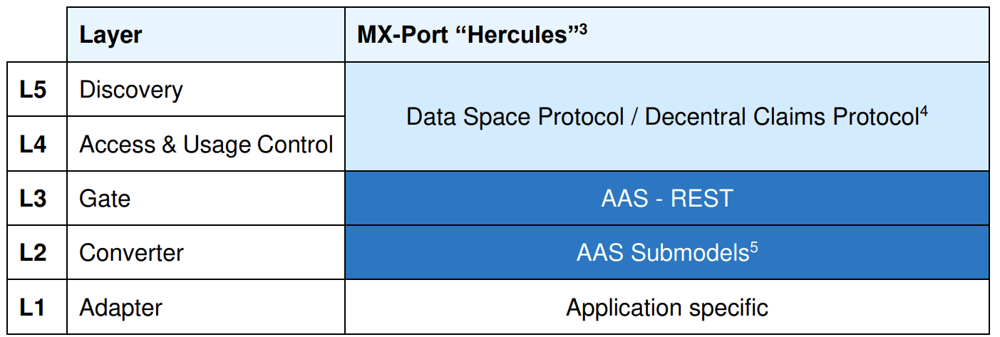

# Is Factory-X EDC right for you?

## Feature set

Factory-X EDC is an intermediation component that allows Business Applications to execute data exchange between
participants according to the Dataspace
Protocol ([DSP](https://eclipse-dataspace-protocol-base.github.io/DataspaceProtocol))
and Decentralized Claims Protocol ([DCP](https://eclipse-dataspace-dcp.github.io/decentralized-claims-protocol/))
specifications in the specific Factory-X flavor. It strives for interoperability with other Manufacturing-X components
such as [tractusx-edc](https://github.com/eclipse-tractusx/tractusx-edc).

The two protocols allow Dataspace particiants to use a single protocol stack to base their trust on either only
themselves or the claims of a commonly trusted third party. Unlike other architectures, this setup does not _require_
an identity provider but only benefits from one. The technologies are usable independently of that.

Participants do not have to use this component as long as their stack behaves in a manner compliant to the
specifications of the MX-Port "Hercules", see [MX-Port concept](https://factory-x.org/wp-content/uploads/MX-Port-Concept-V1.00.pdf) p 7. There are other implementations of DSP and DCP
which can be used for exchange
between participants.

## Premise

Interoperability is always a layered affair. Systems may interoperate to a certain point and diverge later. This is true
also for Factory-X. Factory-X EDC covers L4 and L5 (Discovery, Access & Usage Control) from the [MX-Port concept](https://factory-x.org/wp-content/uploads/MX-Port-Concept-V1.00.pdf). 
It attempts to support all MX-Port configurations for Factory-X that share those common layers. Beneath, the design of
Business APIs serving the relevant data is specific to each use-case. Currently, Factory-X EDC supports the integration
of multiple backend API types.

- HTTP/REST with OAuth2 Client Credential Flow
- HTTP/REST with API keys
- HTTP/REST with mTLS authentication
- HTTP/REST without authentication

They all can be encapsulated via EDC such that a client has a uniform interface that abstracts away the complexity of
lower-level access control.
